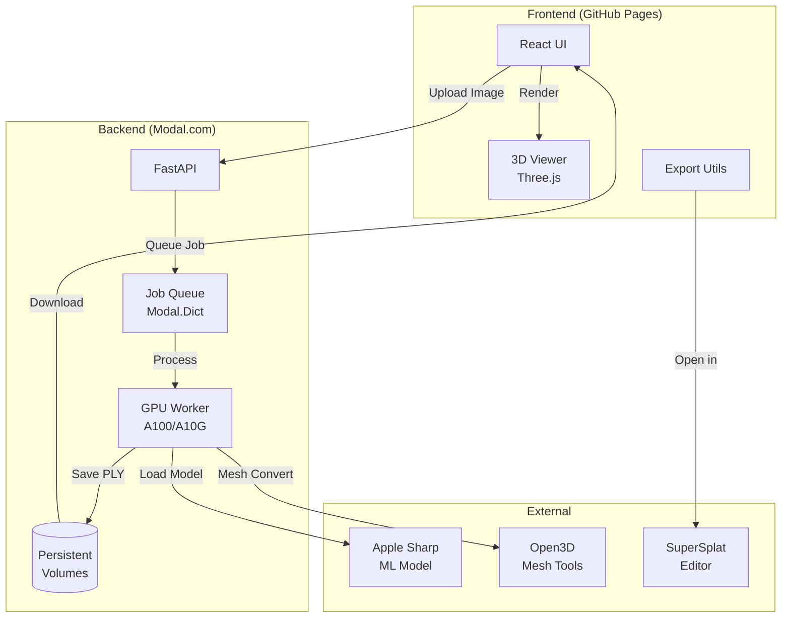
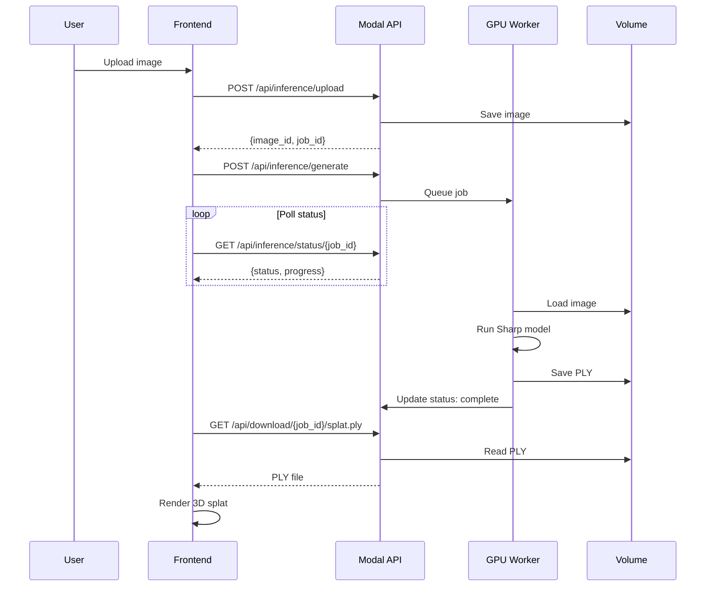

# Apple Sharp Architecture

## System Overview



## Data Flow



## Component Architecture

### Frontend Components

```
app/src/
├── App.tsx                 # Main app, state management
├── components/
│   ├── Header.tsx          # Navigation, status, docs button
│   ├── ImageUpload.tsx     # Drag-drop upload
│   ├── ControlPanel.tsx    # Generate button, view settings
│   ├── OutputsPanel.tsx    # Export options, mesh conversion
│   ├── SplatViewer.tsx     # Three.js 3D viewer
│   ├── LogPanel.tsx        # Real-time logs
│   ├── DocsModal.tsx       # In-app documentation
│   ├── StatsDashboard.tsx  # Usage statistics
│   └── MobileCarousel.tsx  # Mobile layout
├── services/
│   └── api.ts              # HTTP client with retry logic
├── utils/
│   ├── gaussianSplatLoader.ts  # PLY parsing
│   └── meshExporter.ts         # OBJ/PLY/GLB export
└── types/
    └── index.ts            # TypeScript interfaces
```

### Backend Architecture

```
modal_app.py                # Main Modal deployment
├── FastAPI web_app
│   ├── /api/health         # Health check
│   ├── /api/inference/*    # Image upload, generate, status
│   ├── /api/mesh/*         # Mesh conversion
│   ├── /api/download/*     # File downloads
│   └── /api/stats          # Usage statistics
│
├── SharpInference class
│   ├── __enter__           # Preload ML model
│   └── run_inference       # GPU processing
│
└── Modal infrastructure
    ├── GPU: A100/A10G (80GB/24GB)
    ├── Modal.Dict           # Job queue state
    └── Modal.Volume         # Persistent storage
```

## Technology Stack

| Layer | Technology | Purpose |
|-------|------------|---------|
| **Frontend** | React 19 + TypeScript | UI framework |
| | Three.js | 3D rendering |
| | Tailwind CSS 4 | Styling |
| | Vite | Build tool |
| **Backend** | FastAPI | API framework |
| | PyTorch | ML inference |
| | Open3D | Mesh processing |
| | Modal | Serverless GPU |
| **Hosting** | GitHub Pages | Static frontend |
| | Modal.com | Backend + GPU |
| **CI/CD** | GitHub Actions | Auto-deploy |

## File Formats

### PLY (Gaussian Splat)
```
ply
format binary_little_endian 1.0
element vertex 262144
property float x
property float y
property float z
property float f_dc_0   # SH coefficient (red)
property float f_dc_1   # SH coefficient (green)
property float f_dc_2   # SH coefficient (blue)
property float opacity  # Transparency
property float scale_0  # Ellipsoid scale X
property float scale_1  # Ellipsoid scale Y
property float scale_2  # Ellipsoid scale Z
property float rot_0    # Quaternion rotation
property float rot_1
property float rot_2
property float rot_3
property uchar red      # Blender-compatible RGB
property uchar green
property uchar blue
property uchar alpha
end_header
<binary data>
```

### Mesh Conversion Methods

| Method | Best For | Parameters |
|--------|----------|------------|
| **Poisson** | Smooth, watertight meshes | `depth`: 6-12 |
| **Ball Pivoting** | Preserving point positions | `radius`: auto or manual |
| **Alpha Shape** | Fast, concave features | `alpha`: 0.01-2.0 |
